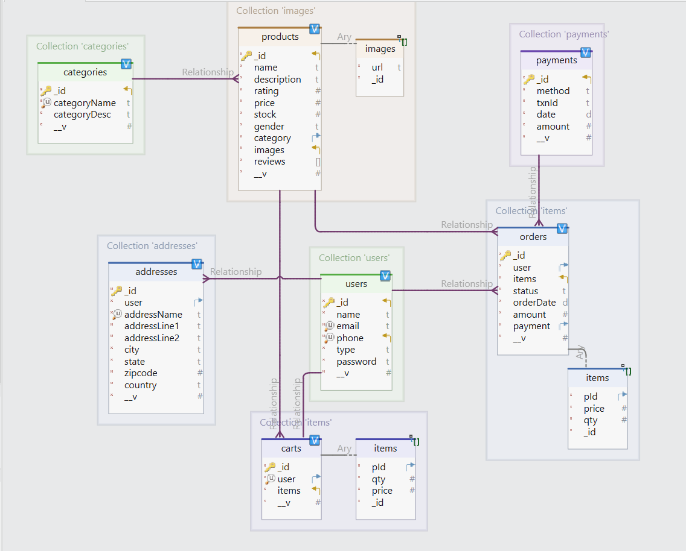

# Backend

## Frameworks / stack used
<ul>
  <li><a href="https://nodejs.org/en">Node Js<a></li>
  <li><a href="https://expressjs.com/">Express Js<a></li>
  <li><a href="https://mongoosejs.com/">Mongoose<a></li>
  <li><a href="https://cloudinary.com/">Cloudinary</a></li>
  <li><a href="https://razorpay.com/docs/api/">RazorPay</a></li>
  <li><a href="https://nodemailer.com/">Nodemailer</a></li>
 
</ul>

## Schema

## Collections :

<ul>
<li>Users</li>
<li>Products</li>
<li>Orders</li>
<li>Address</li>
<li>Categories</li>
<li>Payment</li>  
</ul>

