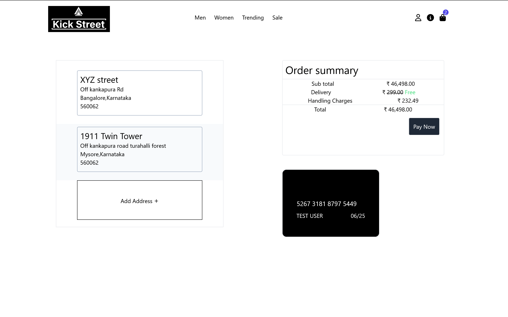
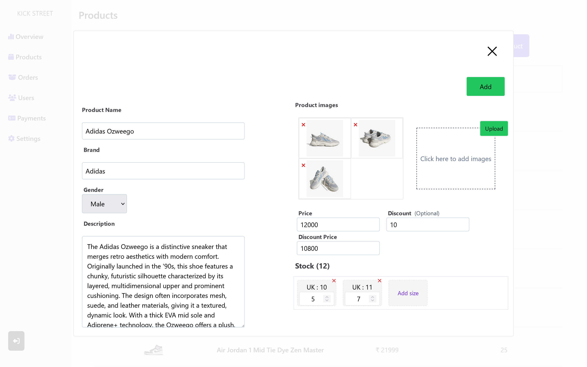
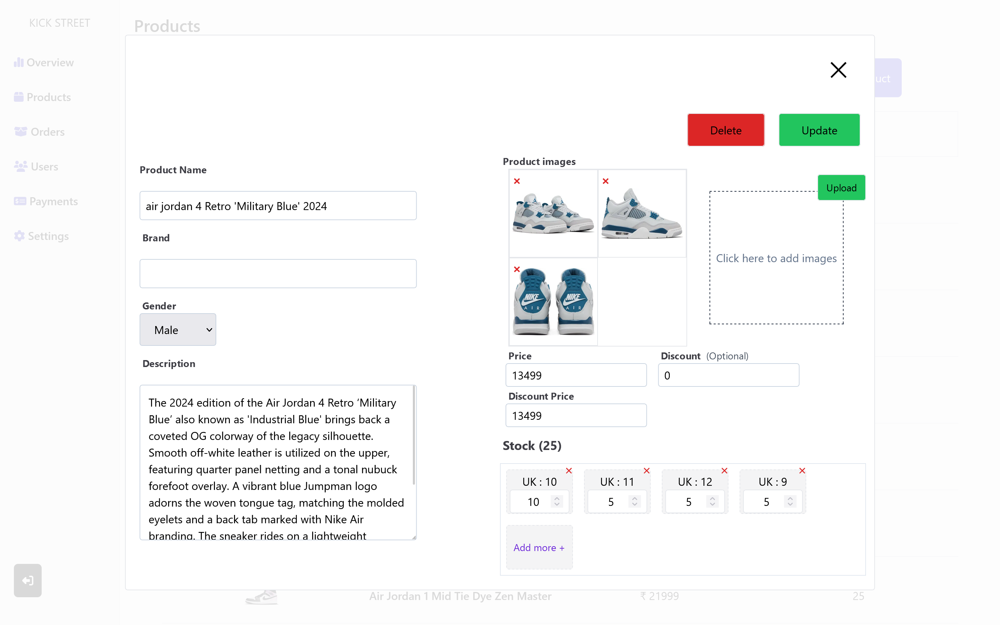

# Kick Street
An online platform for buying sneakers built using MERN stack

Kick Street is an e-commerce platform specializing in the sale of sneakers, developed using MERN stack. The design of the user interface is simple, easy-to-navigate ,effective and is designed to be responsive. Integrated with Cloudinary for image storage and Razorpay for payment processing.

Built using React, Redux, Tailwind CSS, Node Js, Express Js, Mongo DB, Razorpay, Cloudinary, Chart Js, Multer.

## About the app

### Home page

### Product view

### Cart View

### User account view

### Checkout page 

## Admin

### Admin landing page

### All products

### Adding new product

### viewing existing product

### All orders

### Order details of a particular order

### List of users

### Order history of a particular user

# Backend

[Click Here](./Backend/readme.md)

